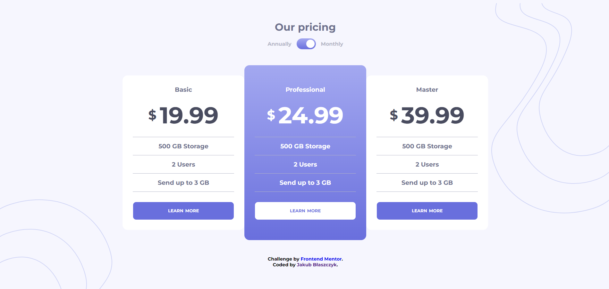
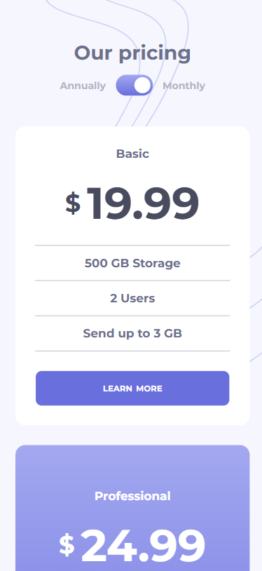

## Frontend Mentor - Pricing component with toggle

This challenge will get you thinking about building an accessible custom toggle control and also test your layout skills.

### Screenshot

|                  Web View                  |                Mobile View                |
| :----------------------------------------: | :---------------------------------------: |
|  |  |

### The challenge

Users should be able to:

- Control the toggle with both their mouse/trackpad and their keyboard
- View the optimal layout for the interface depending on their device's screen size
- See hover and focus states for all interactive elements on the page

### Built with

- HTML
- CSS
- JavaScript
